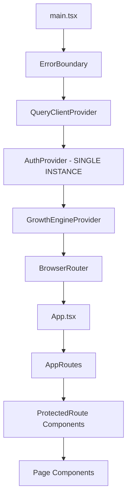

# Authentication Provider Architecture Fix - Design Document

## Overview

This design addresses the critical authentication architecture issues in CropGenius that are causing white screen errors and multiple GoTrueClient instances. The solution involves restructuring the provider hierarchy, implementing proper error boundaries, and ensuring consistent authentication state management.

## Architecture

### Current Issues Analysis

1. **Duplicate AuthProvider instances** - AuthProvider is instantiated in both `main.tsx` and `App.tsx`
2. **Context scope problems** - Components trying to access AuthContext outside provider scope
3. **Multiple Supabase clients** - Multiple GoTrueClient instances causing state conflicts
4. **Loading state stuck** - Authentication initialization getting stuck in loading state
5. **Poor error handling** - White screen instead of meaningful error messages

### Proposed Architecture



## Components and Interfaces

### 1. Enhanced AuthProvider

**Location:** `src/providers/AuthProvider.tsx`

**Key Changes:**
- Single instance only (remove from App.tsx)
- Timeout mechanism for loading states
- Better error handling and recovery
- Proper cleanup of subscriptions

```typescript
interface AuthProviderProps {
  children: ReactNode;
  fallback?: ReactNode; // Custom loading/error fallback
}

interface AuthContextType extends AuthState {
  signOut: () => Promise<void>;
  refreshSession: () => Promise<void>;
  isInitialized: boolean; // New flag to track initialization
}
```

### 2. Improved useAuth Hook

**Location:** `src/hooks/useAuth.ts`

**Key Improvements:**
- Simplified initialization logic
- Better timeout handling
- Reduced retry attempts
- More robust error recovery

### 3. Enhanced ProtectedRoute

**Location:** `src/components/ProtectedRoute.tsx`

**Key Changes:**
- Better error boundary integration
- Fallback UI for auth failures
- Proper loading state handling

### 4. Application Entry Point Restructure

**Location:** `src/main.tsx`

**Structure:**
```typescript
root.render(
  <StrictMode>
    <ErrorBoundary>
      <QueryClientProvider client={queryClient}>
        <AuthProvider>
          <GrowthEngineProvider>
            <App />
          </GrowthEngineProvider>
        </AuthProvider>
        <Toaster />
      </QueryClientProvider>
    </ErrorBoundary>
  </StrictMode>
);
```

### 5. Simplified App Component

**Location:** `src/App.tsx`

**Changes:**
- Remove duplicate AuthProvider
- Remove duplicate QueryClient
- Focus on routing and offline management

## Data Models

### AuthState Interface Enhancement

```typescript
interface AuthState {
  // Core auth state
  user: User | null;
  session: Session | null;
  profile: UserProfile | null;
  
  // Loading states
  isLoading: boolean;
  isLoadingProfile: boolean;
  isRefreshing: boolean;
  isInitialized: boolean; // NEW
  
  // Error states
  error: AppError | null;
  profileError: AppError | null;
  initializationError: AppError | null; // NEW
  
  // Feature flags
  isAuthenticated: boolean;
  isOnboardingComplete: boolean;
  hasProfile: boolean;
}
```

### Error Handling Model

```typescript
interface AuthError {
  code: string;
  message: string;
  userMessage: string;
  recoverable: boolean;
  retryAction?: () => void;
}
```

## Error Handling

### 1. Authentication Initialization Errors

**Strategy:** Progressive fallback with user guidance

```typescript
// Timeout after 10 seconds
const INIT_TIMEOUT = 10000;

// Retry strategy: 2 attempts with exponential backoff
const MAX_RETRIES = 2;
const RETRY_DELAY = 1000;
```

### 2. Context Access Errors

**Strategy:** Graceful degradation with error boundaries

- Catch "useAuthContext must be used within an AuthProvider" errors
- Provide fallback UI with retry mechanism
- Log errors for debugging

### 3. Multiple Client Instance Prevention

**Strategy:** Singleton pattern enforcement

- Single Supabase client instance
- Proper cleanup of duplicate listeners
- Warning detection and resolution

## Testing Strategy

### 1. Unit Tests

**AuthProvider Tests:**
- Context value provision
- Loading state management
- Error state handling
- Cleanup verification

**useAuth Hook Tests:**
- Initialization scenarios
- Error recovery
- State transitions
- Timeout handling

### 2. Integration Tests

**Provider Hierarchy Tests:**
- Context availability at different levels
- Provider ordering verification
- Error boundary integration

**Authentication Flow Tests:**
- Sign in/out flows
- Session management
- Profile loading
- Error scenarios

### 3. E2E Tests

**Application Loading:**
- Cold start scenarios
- Network failure recovery
- Authentication state persistence

## Implementation Plan

### Phase 1: Provider Restructure
1. Remove duplicate AuthProvider from App.tsx
2. Consolidate provider hierarchy in main.tsx
3. Update component tree structure

### Phase 2: Error Handling Enhancement
1. Implement timeout mechanisms
2. Add error boundaries
3. Create fallback UI components

### Phase 3: State Management Improvement
1. Simplify useAuth initialization
2. Add initialization tracking
3. Improve error recovery

### Phase 4: Testing and Validation
1. Add comprehensive tests
2. Validate in development
3. Test production build
4. Performance optimization

## Security Considerations

### 1. Authentication State Protection
- Secure session storage
- Proper token handling
- Session timeout management

### 2. Error Information Exposure
- Sanitize error messages for users
- Detailed logging for developers
- No sensitive data in client errors

### 3. Context Isolation
- Prevent context leakage
- Proper provider boundaries
- Secure state transitions

## Performance Optimizations

### 1. Lazy Loading
- Defer non-critical auth operations
- Progressive profile loading
- Optimistic UI updates

### 2. Caching Strategy
- Profile data caching
- Session state persistence
- Offline capability maintenance

### 3. Bundle Optimization
- Code splitting for auth components
- Lazy loading of auth-related modules
- Reduced initial bundle size

## Monitoring and Debugging

### 1. Development Tools
- Enhanced debug logging
- Auth state visualization
- Provider hierarchy inspection

### 2. Production Monitoring
- Error tracking integration
- Performance metrics
- User experience monitoring

### 3. Debugging Aids
- Context value inspection
- State transition logging
- Error reproduction tools