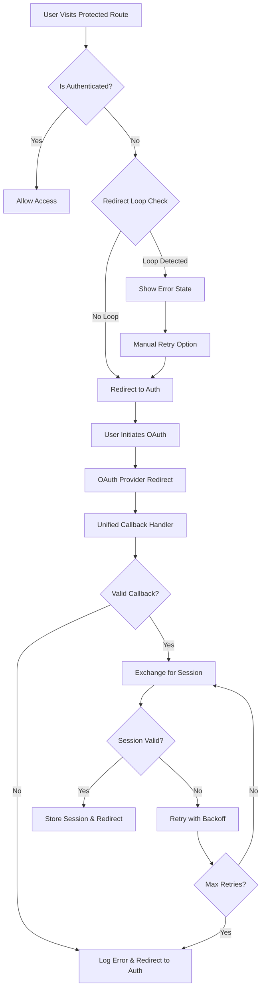

# Design Document

## Overview

The authentication redirect loop issue stems from improper OAuth callback handling and lack of redirect loop prevention mechanisms. The current implementation has multiple callback handlers (`AuthCallback.tsx` and `OAuthCallback.tsx`) with inconsistent error handling, and the `ProtectedRoute` component doesn't prevent infinite redirects when authentication fails repeatedly.

The solution involves consolidating OAuth callback handling, implementing redirect loop detection, improving error handling with proper logging, and adding development bypass functionality.

## Architecture

### Current Authentication Flow Issues

1. **Dual Callback Handlers**: Both `AuthCallback.tsx` and `OAuthCallback.tsx` exist with different logic
2. **Inconsistent Error Handling**: Different error handling approaches across components
3. **No Redirect Loop Prevention**: `ProtectedRoute` can cause infinite redirects
4. **Poor Session Recovery**: Limited retry mechanisms for failed session retrieval
5. **Inadequate Development Support**: Basic bypass functionality without proper mock sessions

### Proposed Authentication Flow



## Components and Interfaces

### 1. Enhanced ProtectedRoute Component

**Purpose**: Prevent redirect loops and provide better authentication state management

**Key Features**:
- Redirect loop detection using session storage
- Configurable retry limits and timeouts
- Development bypass with mock session creation
- Clear error states with manual retry options

**Interface**:
```typescript
interface ProtectedRouteProps {
  children: React.ReactNode;
  maxRedirects?: number;
  redirectTimeout?: number;
  bypassInDev?: boolean;
}

interface RedirectState {
  count: number;
  lastRedirect: number;
  path: string;
}
```

### 2. Unified OAuth Callback Handler

**Purpose**: Single point of OAuth callback processing with comprehensive error handling

**Key Features**:
- Unified callback processing for all OAuth providers
- Comprehensive error logging and reporting
- Session recovery with exponential backoff
- Proper URL parameter validation

**Interface**:
```typescript
interface CallbackState {
  isProcessing: boolean;
  error: string | null;
  retryCount: number;
  sessionRecoveryAttempts: number;
}

interface CallbackParams {
  code?: string;
  state?: string;
  error?: string;
  error_description?: string;
  access_token?: string;
  refresh_token?: string;
}
```

### 3. Authentication Error Handler

**Purpose**: Centralized error handling and logging for authentication issues

**Key Features**:
- Structured error logging with context
- Error categorization and user-friendly messages
- Integration with existing ErrorHandler service
- Performance monitoring for auth operations

**Interface**:
```typescript
interface AuthError {
  code: string;
  message: string;
  userMessage: string;
  context: Record<string, any>;
  timestamp: number;
  retryable: boolean;
}

interface AuthLogger {
  logAuthEvent(event: string, context?: Record<string, any>): void;
  logAuthError(error: AuthError): void;
  logRedirectLoop(state: RedirectState): void;
}
```

### 4. Development Authentication Bypass

**Purpose**: Streamlined development experience with mock authentication

**Key Features**:
- Environment-based bypass activation
- Mock session creation with realistic data structure
- Clear development mode indicators
- Production safety checks

**Interface**:
```typescript
interface DevAuthConfig {
  enabled: boolean;
  mockUser: {
    id: string;
    email: string;
    user_metadata: Record<string, any>;
  };
  mockProfile: {
    id: string;
    full_name: string;
    onboarding_completed: boolean;
  };
}
```

## Data Models

### Session Storage for Redirect Tracking

```typescript
interface RedirectTracker {
  key: string; // 'auth_redirect_tracker'
  data: {
    redirectCount: number;
    lastRedirectTime: number;
    originalPath: string;
    userAgent: string; // For debugging
  };
}
```

### Enhanced Auth State

```typescript
interface EnhancedAuthState extends AuthState {
  redirectLoopDetected: boolean;
  lastAuthError: AuthError | null;
  sessionRecoveryAttempts: number;
  isDevelopmentBypass: boolean;
}
```

## Error Handling

### Error Categories

1. **OAuth Callback Errors**
   - Invalid callback parameters
   - Provider-specific errors
   - State parameter mismatches
   - PKCE flow failures

2. **Session Errors**
   - Session exchange failures
   - Token refresh failures
   - Session validation errors
   - Network connectivity issues

3. **Redirect Loop Errors**
   - Excessive redirect attempts
   - Circular navigation patterns
   - Authentication state inconsistencies

### Error Recovery Strategies

1. **Exponential Backoff**: For session retrieval failures
2. **Circuit Breaker**: For repeated authentication failures
3. **Graceful Degradation**: Fallback to cached session data
4. **Manual Recovery**: User-initiated retry mechanisms

### Logging Strategy

```typescript
interface AuthLogEntry {
  timestamp: number;
  level: 'info' | 'warn' | 'error';
  event: string;
  userId?: string;
  sessionId?: string;
  context: {
    url: string;
    userAgent: string;
    redirectCount?: number;
    errorCode?: string;
    retryAttempt?: number;
  };
}
```

## Testing Strategy

### Unit Tests

1. **ProtectedRoute Component**
   - Redirect loop detection logic
   - Development bypass functionality
   - Error state rendering
   - Navigation behavior

2. **OAuth Callback Handler**
   - Parameter validation
   - Session exchange logic
   - Error handling paths
   - Retry mechanisms

3. **Authentication Utilities**
   - Error categorization
   - Logging functionality
   - Session validation
   - Mock session creation

### Integration Tests

1. **Authentication Flow**
   - Complete OAuth flow simulation
   - Redirect loop scenarios
   - Error recovery testing
   - Development bypass testing

2. **Error Scenarios**
   - Network failure simulation
   - Invalid callback parameters
   - Session expiration handling
   - Provider error responses

### End-to-End Tests

1. **User Journey Testing**
   - Successful authentication flow
   - Authentication failure recovery
   - Redirect loop prevention
   - Development mode testing

## Implementation Approach

### Phase 1: Redirect Loop Prevention
- Enhance ProtectedRoute with loop detection
- Implement session storage tracking
- Add manual retry mechanisms

### Phase 2: Unified Callback Handling
- Consolidate callback handlers
- Implement comprehensive error handling
- Add session recovery with backoff

### Phase 3: Enhanced Logging and Monitoring
- Implement structured auth logging
- Add performance monitoring
- Integrate with existing error handling

### Phase 4: Development Experience
- Enhance development bypass
- Add mock session creation
- Implement development indicators

### Phase 5: Testing and Validation
- Comprehensive test coverage
- Error scenario validation
- Performance optimization

## Security Considerations

1. **Development Bypass Safety**
   - Environment variable checks
   - Production deployment guards
   - Clear development indicators

2. **Session Security**
   - Secure session storage
   - Token validation
   - PKCE flow compliance

3. **Error Information Disclosure**
   - Sanitized error messages
   - Sensitive data filtering
   - Audit trail maintenance

## Performance Considerations

1. **Redirect Loop Detection**
   - Minimal session storage usage
   - Efficient timestamp comparisons
   - Cleanup of stale tracking data

2. **Session Recovery**
   - Exponential backoff implementation
   - Request deduplication
   - Timeout management

3. **Logging Performance**
   - Asynchronous logging
   - Batch log processing
   - Storage optimization