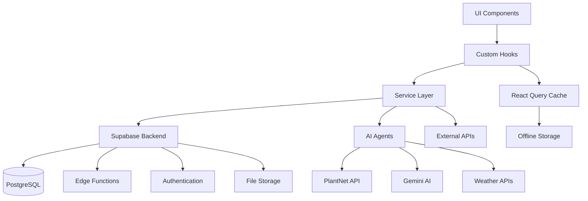

# UI Component Resurrection Design

## Overview

This design document outlines the systematic resurrection of CropGenius UI components from deceptive facades into production-ready, AI-integrated agricultural intelligence systems. The architecture prioritizes real data connections, comprehensive error handling, and seamless user experience for African farmers.

## Architecture

### Core Principles

1. **Data-First Architecture**: Every component connects to real data sources
2. **Resilient Error Handling**: Comprehensive error recovery at every layer
3. **Offline-First Design**: Robust caching and synchronization for rural connectivity
4. **AI Integration**: Intelligent features powered by real AI services
5. **Performance Optimization**: Optimized for low-bandwidth environments

### System Architecture



## Components and Interfaces

### 1. AIChatWidget Resurrection

#### Architecture
- **AgentService**: Routes messages to specialized AI agents
- **ChatHook**: Manages conversation state with React Query
- **FarmContextHook**: Fetches and validates real farm data
- **ConversationStorage**: Persists chats to Supabase

#### Key Interfaces
```typescript
interface AgentService {
  routeMessage(message: string, context: FarmContext): Promise<AgentResponse>
  getAvailableAgents(): Agent[]
  getConfidenceScore(response: AgentResponse): number
}

interface ChatConversation {
  id: string
  user_id: string
  farm_id: string
  messages: ChatMessage[]
  context: FarmContext
  created_at: string
  updated_at: string
}
```

#### Implementation Strategy
1. Create real AgentService connecting to Supabase Edge Functions
2. Implement chat_conversations table with proper RLS
3. Build FarmContextHook to fetch validated farm data
4. Add comprehensive error recovery and offline support
5. Connect quick actions to specialized agent functions

### 2. HealthOrb Real-Time Monitoring

#### Architecture
- **FarmHealthHook**: Fetches real-time health data
- **HealthCalculationService**: Processes multiple data sources
- **VisualStateManager**: Maps health data to visual properties

#### Key Interfaces
```typescript
interface FarmHealthData {
  healthScore: number
  trustIndicators: TrustIndicator[]
  lastUpdated: string
  dataQuality: number
  factors: HealthFactor[]
}

interface TrustIndicator {
  type: 'soil' | 'weather' | 'disease' | 'market'
  status: 'good' | 'warning' | 'critical'
  value: number
  trend: 'up' | 'down' | 'stable'
}
```

#### Implementation Strategy
1. Create useFarmHealth hook with React Query
2. Connect to field-ai-insights Edge Function
3. Implement loading and error states with skeletons
4. Map health data to orb visual properties
5. Add real-time updates with Supabase subscriptions

### 3. GodModeLayout Network Integration

#### Architecture
- **NetworkMonitor**: Real-time connectivity monitoring
- **DeviceStatusHook**: Battery, signal, and device metrics
- **NotificationService**: Real notification system integration
- **AchievementEngine**: Gamification backend connection

#### Key Interfaces
```typescript
interface NetworkStatus {
  isOnline: boolean
  connectionType: 'wifi' | 'cellular' | 'unknown'
  signalStrength: number
  latency: number
}

interface DeviceStatus {
  batteryLevel: number
  isCharging: boolean
  deviceType: 'mobile' | 'tablet' | 'desktop'
  orientation: 'portrait' | 'landscape'
}
```

#### Implementation Strategy
1. Implement useOfflineStatus hook for real network monitoring
2. Create useDeviceStatus hook with Battery API integration
3. Connect to real notification system via useNotifications
4. Integrate with gamification backend for achievement triggers
5. Add proper loading states and context integration

### 4. OneFingerNavigation Dynamic Routes

#### Architecture
- **NavigationContextProvider**: Dynamic route generation
- **PermissionService**: User permission management
- **NavigationStateHook**: Persistent navigation state
- **DeepLinkingService**: Complex navigation pattern support

#### Key Interfaces
```typescript
interface NavigationItem {
  id: string
  label: string
  icon: string
  route: string
  permissions: string[]
  badge?: NotificationBadge
  children?: NavigationItem[]
}

interface NavigationState {
  expandedItems: string[]
  recentRoutes: string[]
  favoriteRoutes: string[]
}
```

#### Implementation Strategy
1. Create navigation context with permission-based route generation
2. Implement useNavigationState for session persistence
3. Connect to AuthContext for permission-based visibility
4. Add deep linking support with complex patterns
5. Integrate notification badges for updates

### 5. MobileLayout Voice and Haptic Integration

#### Architecture
- **VoiceRecognitionService**: Real voice command processing
- **HapticFeedbackManager**: Web Vibration API integration
- **GamificationEngine**: Real achievement backend
- **DeviceIntegrationService**: Device status and capabilities

#### Key Interfaces
```typescript
interface VoiceCommand {
  command: string
  confidence: number
  intent: string
  parameters: Record<string, any>
}

interface HapticPattern {
  type: 'success' | 'warning' | 'error' | 'notification'
  pattern: number[]
  intensity?: number
}
```

#### Implementation Strategy
1. Implement real haptic feedback using Web Vibration API
2. Create gamification engine connecting to backend services
3. Connect VoiceCommandChip to real voice recognition
4. Integrate real device status monitoring
5. Add comprehensive offline mode support

## Data Models

### Chat System
```sql
CREATE TABLE chat_conversations (
  id UUID PRIMARY KEY DEFAULT gen_random_uuid(),
  user_id UUID REFERENCES profiles(id) ON DELETE CASCADE,
  farm_id UUID REFERENCES farms(id) ON DELETE CASCADE,
  title TEXT,
  context JSONB,
  created_at TIMESTAMPTZ DEFAULT NOW(),
  updated_at TIMESTAMPTZ DEFAULT NOW()
);

CREATE TABLE chat_messages (
  id UUID PRIMARY KEY DEFAULT gen_random_uuid(),
  conversation_id UUID REFERENCES chat_conversations(id) ON DELETE CASCADE,
  role TEXT CHECK (role IN ('user', 'assistant', 'system')),
  content TEXT NOT NULL,
  metadata JSONB,
  created_at TIMESTAMPTZ DEFAULT NOW()
);
```

### Farm Health Monitoring
```sql
CREATE TABLE farm_health_snapshots (
  id UUID PRIMARY KEY DEFAULT gen_random_uuid(),
  farm_id UUID REFERENCES farms(id) ON DELETE CASCADE,
  health_score DECIMAL(3,2) CHECK (health_score >= 0 AND health_score <= 1),
  trust_indicators JSONB,
  factors JSONB,
  data_quality DECIMAL(3,2),
  created_at TIMESTAMPTZ DEFAULT NOW()
);
```

### Navigation and Permissions
```sql
CREATE TABLE user_permissions (
  id UUID PRIMARY KEY DEFAULT gen_random_uuid(),
  user_id UUID REFERENCES profiles(id) ON DELETE CASCADE,
  permission TEXT NOT NULL,
  granted_at TIMESTAMPTZ DEFAULT NOW(),
  granted_by UUID REFERENCES profiles(id)
);

CREATE TABLE navigation_state (
  user_id UUID PRIMARY KEY REFERENCES profiles(id) ON DELETE CASCADE,
  state JSONB NOT NULL,
  updated_at TIMESTAMPTZ DEFAULT NOW()
);
```

## Error Handling

### Error Classification System
```typescript
enum ErrorType {
  NETWORK = 'network',
  AUTHENTICATION = 'authentication',
  PERMISSION = 'permission',
  DATA_VALIDATION = 'data_validation',
  AI_SERVICE = 'ai_service',
  EXTERNAL_API = 'external_api'
}

interface ErrorContext {
  type: ErrorType
  code: string
  message: string
  recoverable: boolean
  retryable: boolean
  context: Record<string, any>
}
```

### Recovery Strategies
1. **Network Errors**: Automatic retry with exponential backoff
2. **Authentication Errors**: Token refresh and re-authentication flows
3. **Permission Errors**: Graceful degradation and alternative flows
4. **Data Errors**: Validation feedback and correction guidance
5. **AI Service Errors**: Fallback to cached responses or alternative services

## Testing Strategy

### Component Testing
- Unit tests for all hooks and services
- Integration tests for component-service interactions
- Mock implementations for external services
- Error scenario testing for all failure modes

### End-to-End Testing
- User journey testing across all resurrected components
- Offline/online transition testing
- Performance testing under various network conditions
- Cross-device compatibility testing

### AI Integration Testing
- Mock AI responses for consistent testing
- Confidence score validation
- Error handling for AI service failures
- Performance testing for AI-powered features

## Performance Optimization

### Caching Strategy
- React Query for server state management
- Service Worker for offline asset caching
- IndexedDB for large offline data storage
- Memory caching for frequently accessed data

### Network Optimization
- Request deduplication and batching
- Optimistic updates for better UX
- Progressive data loading
- Compression for large payloads

### Mobile Optimization
- Touch-friendly interfaces (44px minimum targets)
- Thumb-zone navigation patterns
- Reduced motion for battery conservation
- Efficient rendering for older devices

## Security Considerations

### Data Protection
- Row Level Security (RLS) on all user data
- API key management through environment variables
- Input validation and sanitization
- Secure token storage and transmission

### Authentication Security
- Multi-factor authentication support
- Session management with proper expiration
- PKCE flow for OAuth
- Secure password requirements

### API Security
- Rate limiting on all endpoints
- Request signing for sensitive operations
- CORS configuration for web security
- Content Security Policy headers

## Deployment Strategy

### Environment Management
- Development, staging, and production environments
- Environment-specific configuration
- Feature flags for gradual rollouts
- Monitoring and alerting for all environments

### Database Migrations
- Versioned migration scripts
- Rollback procedures for failed deployments
- Data integrity checks
- Performance impact assessment

### Monitoring and Observability
- Real-time error tracking
- Performance monitoring
- User behavior analytics
- AI service performance metrics

This design provides the foundation for transforming CropGenius from a collection of deceptive UI facades into a genuinely powerful agricultural intelligence platform that serves farmers with real, actionable insights and functionality.