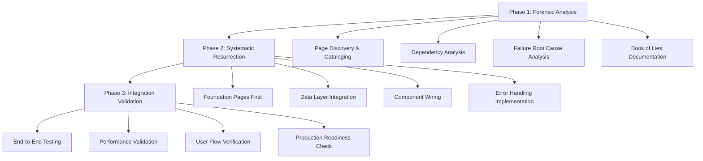
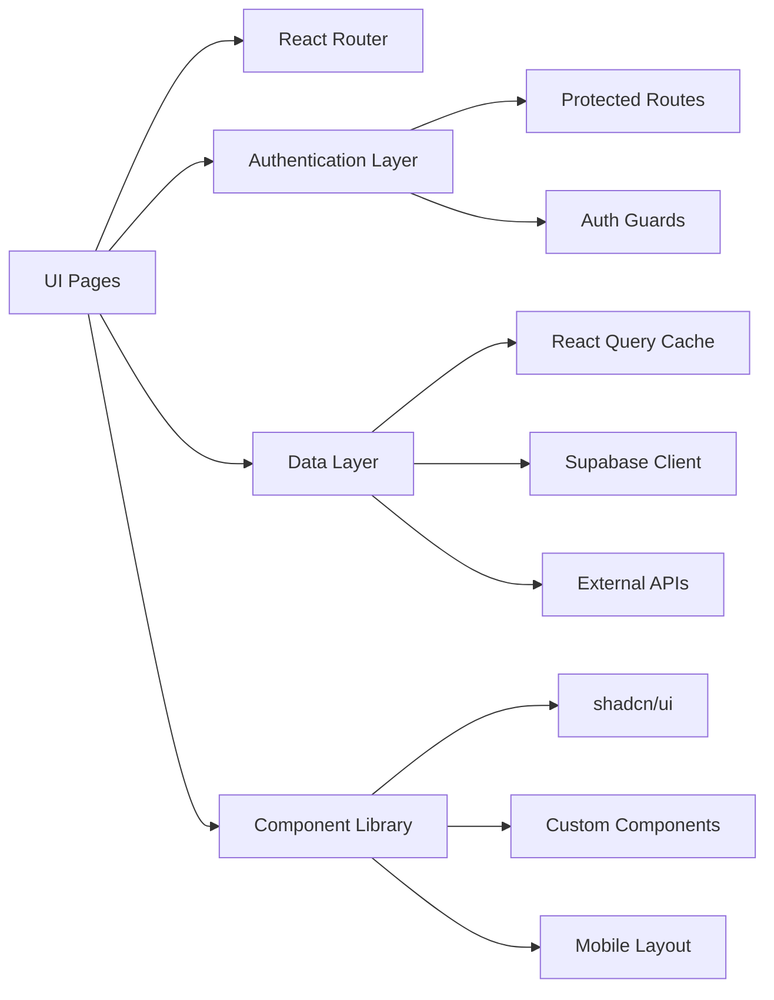

# UI Resurrection Phoenix - Design Document

## Overview

The UI Resurrection Phoenix project is designed as a systematic, forensic-level investigation and reconstruction of the CropGenius user interface layer. This design implements a three-phase approach: **Forensic Analysis**, **Systematic Resurrection**, and **Integration Validation**. The architecture treats each page as an independent system that must be fully integrated with the backend infrastructure, data layer, routing system, and user experience flow.

## Architecture

### Phase-Based Execution Model



### System Integration Architecture



## Components and Interfaces

### 1. Forensic Analysis Engine

**Purpose**: Systematically analyze every page file to understand current state and failure points.

**Interface**:
```typescript
interface PageAnalysis {
  filePath: string;
  intendedPurpose: string;
  currentState: 'functional' | 'partial' | 'broken' | 'missing';
  failurePoints: FailurePoint[];
  dependencies: Dependency[];
  resurrectionPlan: ResurrectionStep[];
}

interface FailurePoint {
  type: 'routing' | 'data' | 'component' | 'typescript' | 'integration';
  severity: 'critical' | 'major' | 'minor';
  description: string;
  location: string;
  suggestedFix: string;
}
```

**Implementation Strategy**:
- Recursive file system analysis of src/pages directory
- Static code analysis to identify imports, exports, and dependencies
- Cross-reference with routing configuration
- Database schema validation against data queries
- Component dependency tree analysis

### 2. Page Resurrection Framework

**Purpose**: Standardized approach to resurrect each page with consistent patterns.

**Interface**:
```typescript
interface ResurrectedPage {
  component: React.FC;
  route: RouteConfig;
  dataHooks: DataHook[];
  errorBoundary: ErrorBoundaryConfig;
  loadingStates: LoadingStateConfig;
  testSuite: TestConfig;
}

interface DataHook {
  name: string;
  source: 'supabase' | 'external-api' | 'local-storage';
  caching: ReactQueryConfig;
  errorHandling: ErrorHandlingConfig;
}
```

**Implementation Strategy**:
- Template-based page reconstruction
- Standardized data fetching patterns using React Query
- Consistent error boundary implementation
- Mobile-first responsive design patterns
- Automated test generation for each resurrected page

### 3. Data Integration Layer

**Purpose**: Ensure all pages properly connect to the Supabase backend and external APIs.

**Database Tables Analysis**:
Based on the codebase examination, key tables include:
- `profiles` - User information and preferences
- `farms` - Farm metadata and ownership
- `fields` - Field boundaries and crop data
- `crop_prices` - Market pricing data
- `weather_data` - Weather information
- `ai_conversations` - Chat history
- `credit_transactions` - User credits and payments

**API Integration Points**:
- Supabase Auth for authentication
- Supabase Database for core data
- External weather APIs
- AI service endpoints (Gemini, PlantNet)
- Market data APIs

### 4. Component Wiring System

**Purpose**: Ensure all child components are properly connected with correct props and state.

**Component Categories**:
1. **Layout Components**: MobileLayout, navigation, headers
2. **Data Display Components**: Cards, tables, charts, lists
3. **Interactive Components**: Forms, buttons, modals
4. **AI Components**: Chat interfaces, image upload, results display
5. **Utility Components**: Loading states, error boundaries, empty states

## Data Models

### Page State Management

```typescript
interface PageState {
  loading: boolean;
  error: Error | null;
  data: any;
  user: User | null;
  permissions: Permission[];
}

interface LoadingState {
  initial: boolean;
  refreshing: boolean;
  submitting: boolean;
  processing: boolean;
}

interface ErrorState {
  type: 'network' | 'auth' | 'validation' | 'server' | 'unknown';
  message: string;
  recoverable: boolean;
  retryAction?: () => void;
}
```

### Data Fetching Patterns

```typescript
interface DataFetchingConfig {
  queryKey: string[];
  queryFn: () => Promise<any>;
  staleTime: number;
  cacheTime: number;
  refetchOnWindowFocus: boolean;
  retry: number | boolean;
  onError: (error: Error) => void;
  onSuccess: (data: any) => void;
}
```

## Error Handling

### Multi-Layer Error Handling Strategy

1. **Component Level**: Try/catch blocks for async operations
2. **Hook Level**: Error states in custom hooks
3. **Boundary Level**: React Error Boundaries for component crashes
4. **Global Level**: Global error handler for unhandled errors

```typescript
interface ErrorHandlingStrategy {
  componentLevel: {
    asyncOperations: 'try-catch';
    stateUpdates: 'error-state';
    userFeedback: 'toast-notifications';
  };
  boundaryLevel: {
    componentCrashes: 'error-boundary';
    fallbackUI: 'error-fallback-component';
    errorReporting: 'console-logging';
  };
  globalLevel: {
    unhandledErrors: 'global-error-handler';
    networkErrors: 'retry-mechanism';
    authErrors: 'redirect-to-login';
  };
}
```

### Error Recovery Mechanisms

- **Automatic Retry**: For network-related failures
- **Graceful Degradation**: Fallback content when features fail
- **User-Initiated Recovery**: Refresh buttons and retry actions
- **Offline Support**: Cached data when network is unavailable

## Testing Strategy

### Comprehensive Testing Approach

1. **Unit Tests**: Individual component functionality
2. **Integration Tests**: Component interaction with data layer
3. **End-to-End Tests**: Complete user workflows
4. **Visual Regression Tests**: UI consistency across devices

```typescript
interface TestSuite {
  unitTests: {
    componentRendering: boolean;
    propHandling: boolean;
    stateManagement: boolean;
    eventHandling: boolean;
  };
  integrationTests: {
    dataFetching: boolean;
    errorHandling: boolean;
    userInteractions: boolean;
    routingBehavior: boolean;
  };
  e2eTests: {
    userWorkflows: boolean;
    crossPageNavigation: boolean;
    authenticationFlows: boolean;
    dataConsistency: boolean;
  };
}
```

### Test Implementation Strategy

- **React Testing Library**: For component testing
- **MSW (Mock Service Worker)**: For API mocking
- **Vitest**: For test execution and coverage
- **Playwright**: For end-to-end testing (future implementation)

## Performance Optimization

### Page Loading Optimization

1. **Code Splitting**: Lazy loading for non-critical pages
2. **Data Prefetching**: Anticipatory data loading
3. **Image Optimization**: Lazy loading and responsive images
4. **Bundle Optimization**: Tree shaking and dead code elimination

```typescript
interface PerformanceConfig {
  codeSplitting: {
    routeLevel: boolean;
    componentLevel: boolean;
    lazyLoading: boolean;
  };
  dataOptimization: {
    reactQueryCaching: boolean;
    prefetching: boolean;
    backgroundRefresh: boolean;
  };
  assetOptimization: {
    imageLazyLoading: boolean;
    responsiveImages: boolean;
    assetCompression: boolean;
  };
}
```

## Mobile-First Design Implementation

### Responsive Design Strategy

1. **Mobile Layout Integration**: Proper MobileLayout wrapper usage
2. **Touch-Friendly Interfaces**: Minimum 44px touch targets
3. **Thumb-Zone Navigation**: Bottom navigation and accessible controls
4. **Performance on Mobile**: Optimized for slower connections

```typescript
interface MobileDesignConfig {
  layout: {
    mobileLayoutWrapper: boolean;
    responsiveBreakpoints: boolean;
    orientationSupport: boolean;
  };
  interaction: {
    touchTargetSize: '44px';
    thumbZoneNavigation: boolean;
    gestureSupport: boolean;
  };
  performance: {
    mobileOptimization: boolean;
    offlineSupport: boolean;
    progressiveLoading: boolean;
  };
}
```

## Security Considerations

### Authentication and Authorization

1. **Route Protection**: ProtectedRoute wrapper for authenticated pages
2. **Permission Checking**: Role-based access control
3. **Data Security**: Row Level Security (RLS) enforcement
4. **Input Validation**: Client and server-side validation

```typescript
interface SecurityConfig {
  authentication: {
    routeProtection: boolean;
    sessionManagement: boolean;
    tokenRefresh: boolean;
  };
  authorization: {
    roleBasedAccess: boolean;
    permissionChecking: boolean;
    resourceAccess: boolean;
  };
  dataProtection: {
    inputValidation: boolean;
    outputSanitization: boolean;
    rlsEnforcement: boolean;
  };
}
```

## Implementation Phases

### Phase 1: Forensic Analysis (Days 1-2)
- Complete page inventory and analysis
- Dependency mapping and failure identification
- "Book of Lies" documentation creation
- Priority ranking for resurrection order

### Phase 2: Systematic Resurrection (Days 3-10)
- Foundation pages (Auth, Index, Dashboard)
- Core feature pages (Fields, Weather, Market, Scan)
- Secondary feature pages (Community, Settings, etc.)
- Admin and utility pages

### Phase 3: Integration Validation (Days 11-12)
- End-to-end testing of all pages
- Performance optimization and validation
- User flow verification
- Production readiness assessment

## Success Metrics

### Quantitative Metrics
- **Page Functionality**: 100% of pages fully functional
- **Test Coverage**: >90% code coverage across all pages
- **Performance**: <3s initial load time, <1s navigation
- **Error Rate**: <1% unhandled errors in production

### Qualitative Metrics
- **User Experience**: Seamless navigation between all pages
- **Data Consistency**: All pages display accurate, real-time data
- **Mobile Experience**: Fully responsive and touch-optimized
- **Code Quality**: Production-ready, maintainable codebase

This design provides a comprehensive framework for systematically resurrecting the CropGenius UI layer, ensuring that every page becomes a fully functional, production-ready component of the agricultural intelligence platform.