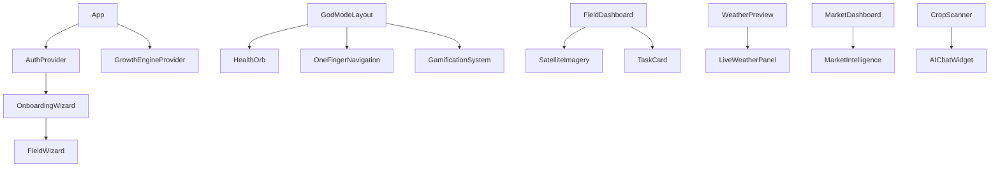

# 🧩 CROPGENIUS COMPONENT LATTICE BLUEPRINT

## 📱 COMPLETE UI HIERARCHY TREE

```
<App> (src/App.tsx)
├── <ErrorBoundary> (src/components/error/ErrorBoundary.tsx)
├── <QueryClientProvider>
├── <UserMetaProvider> (src/context/UserMetaContext.tsx)
├── <BrowserRouter>
├── <TooltipProvider>
├── <AppRoutes> (src/AppRoutes.tsx)
│   ├── <AuthProvider> (src/providers/AuthProvider.tsx)
│   ├── <GrowthEngineProvider> (src/providers/GrowthEngineProvider.tsx)
│   ├── <Routes>
│   │   ├── <Route path="/auth">
│   │   │   └── <AuthPage> (src/features/auth/components/AuthPage.tsx)
│   │   │       ├── <LoginPage> (src/features/auth/components/LoginPage.tsx)
│   │   │       └── <SignupPage> (src/features/auth/components/SignupPage.tsx)
│   │   ├── <Route path="/onboarding">
│   │   │   └── <OnboardingWizard> (src/features/onboarding/OnboardingWizard.tsx)
│   │   │       ├── <StepOneFarmVitals> (src/features/onboarding/steps/StepOneFarmVitals.tsx)
│   │   │       ├── <StepTwoCropSeasons> (src/features/onboarding/steps/StepTwoCropSeasons.tsx)
│   │   │       ├── <StepThreeGoals> (src/features/onboarding/steps/StepThreeGoals.tsx)
│   │   │       ├── <StepFourResources> (src/features/onboarding/steps/StepFourResources.tsx)
│   │   │       ├── <StepFiveProfile> (src/features/onboarding/steps/StepFiveProfile.tsx)
│   │   │       └── <StepSixGeniusPlan> (src/features/onboarding/steps/StepSixGeniusPlan.tsx)
│   │   ├── <Route path="/home"> (Mobile Only)
│   │   │   └── <MobileHomePage> (src/pages/home/MobileHomePage.tsx)
│   │   │       └── <GodModeLayout> (src/components/dashboard/mobile/GodModeLayout.tsx)
│   │   │           ├── <FloatingParticles> (src/components/dashboard/mobile/PremiumAnimations.tsx)
│   │   │           ├── <SuccessCelebration> (src/components/dashboard/mobile/PremiumAnimations.tsx)
│   │   │           ├── <HealthOrb> (src/components/dashboard/mobile/HealthOrb.tsx)
│   │   │           ├── <OneFingerNavigation> (src/components/dashboard/mobile/OneFingerNavigation.tsx)
│   │   │           ├── <GamificationSystem> (src/components/dashboard/mobile/GamificationSystem.tsx)
│   │   │           ├── <SmartFarmTools> (src/components/home/SmartFarmTools.tsx)
│   │   │           ├── <TodaysFarmPlan> (src/components/home/TodaysFarmPlan.tsx)
│   │   │           ├── <WeatherPreview> (src/components/home/WeatherPreview.tsx)
│   │   │           ├── <CropScannerPreview> (src/components/home/CropScannerPreview.tsx)
│   │   │           ├── <MarketPreview> (src/components/home/MarketPreview.tsx)
│   │   │           └── <AIChatPreview> (src/components/home/AIChatPreview.tsx)
│   │   ├── <Route path="/dashboard"> (Desktop)
│   │   │   └── <MissionControlPage> (src/pages/MissionControlPage.tsx)
│   │   │       ├── <ResponsiveLayout> (src/components/layout/ResponsiveLayout.tsx)
│   │   │       ├── <PowerHeader> (src/components/dashboard/PowerHeader.tsx)
│   │   │       ├── <MissionControl> (src/components/dashboard/MissionControl.tsx)
│   │   │       ├── <FieldIntelligence> (src/components/dashboard/FieldIntelligence.tsx)
│   │   │       └── <MoneyZone> (src/components/dashboard/MoneyZone.tsx)
│   │   ├── <Route path="/field/:fieldId">
│   │   │   └── <FieldDetailPage> (src/pages/FieldDetail.tsx)
│   │   │       ├── <FieldDashboard> (src/components/FieldDashboard.tsx)
│   │   │       ├── <SatelliteImageryDisplay> (src/components/SatelliteImageryDisplay.tsx)
│   │   │       ├── <FieldHistoryTracker> (src/components/FieldHistoryTracker.tsx)
│   │   │       └── <TaskCard> (src/features/mission-control/components/TaskCard.tsx)
│   │   ├── <Route path="/market">
│   │   │   └── <MarketInsightsPage> (src/pages/MarketInsightsPage.tsx)
│   │   │       ├── <MarketInsightsDashboard> (src/components/MarketInsightsDashboard.tsx)
│   │   │       └── <MarketIntelligenceBoard> (src/components/MarketIntelligenceBoard.tsx)
│   │   ├── <Route path="/scan">
│   │   │   └── <CropScanner> (src/components/scanner/CropScanner.tsx)
│   │   └── <Route path="/weather">
│   │       └── <WeatherPage> (src/pages/Weather.tsx)
│   │           ├── <LiveWeatherPanel> (src/components/weather/LiveWeatherPanel.tsx)
│   │           ├── <ForecastPanel> (src/components/weather/ForecastPanel.tsx)
│   │           ├── <FarmActionsList> (src/components/weather/FarmActionsList.tsx)
│   │           ├── <DisasterAlerts> (src/components/weather/DisasterAlerts.tsx)
│   │           └── <SeasonalPredictions> (src/components/weather/SeasonalPredictions.tsx)
├── <Toaster> (src/components/ui/toaster.tsx)
├── <Sonner> (src/components/ui/sonner.tsx)
├── <UpdateNotification> (src/components/UpdateNotification.tsx)
├── <NetworkStatus> (src/components/NetworkStatus.tsx)
└── <DevDebugPanel> (src/components/debug/DevDebugPanel.tsx) [DEV ONLY]
```

## 🎯 COMPONENT-TO-AGENT CONNECTION MAP

| Component | Connected Agents | Data Flow | State Management |
|-----------|------------------|-----------|------------------|
| `CropScanner.tsx` | CropDiseaseOracle | Image → Analysis → Results | useState + React Query |
| `WeatherPreview.tsx` | WeatherAgent | Location → Weather → Advice | React Query |
| `FieldIntelligence.tsx` | FieldBrainAgent | Coordinates → NDVI → Health | React Query |
| `MarketInsightsDashboard.tsx` | SmartMarketAgent | Crop → Prices → Recommendations | React Query |
| `AIChatWidget.tsx` | GenieAgent | Message → Intent → Response | useState |
| `HealthOrb.tsx` | Multiple Agents | Farm Data → Health Score → Animation | useEffect |
| `GamificationSystem.tsx` | GrowthEngine | Actions → XP → Achievements | Context |
| `TaskCard.tsx` | AIFarmPlanAgent | Task → Priority → Recommendations | useState |

## 🔄 MODAL/SHEET/DIALOG INVOCATION TREE

```
Modal System:
├── <ProUpgradeModal> (src/components/pro/ProUpgradeModal.tsx)
│   ├── Triggered by: Credit depletion, premium features
│   └── Contains: Pricing plans, payment integration
├── <CreateTaskModal> (src/features/mission-control/components/CreateTaskModal.tsx)
│   ├── Triggered by: Add task button, AI suggestions
│   └── Contains: Task form, field selection, priority
├── <AddFieldWizard> (src/components/fields/wizard/AddFieldWizard.tsx)
│   ├── Triggered by: Add field button
│   └── Contains: 5-step field creation process
├── <OutOfCreditsModal> (src/components/growth/OutOfCreditsModal.tsx)
│   ├── Triggered by: API call failures due to credits
│   └── Contains: Credit purchase options
├── <InviteModal> (src/components/referrals/InviteModal.tsx)
│   ├── Triggered by: Referral system
│   └── Contains: Invite links, social sharing
└── <OverdriveModal> (src/components/growth/OverdriveModal.tsx)
    ├── Triggered by: Premium feature access
    └── Contains: Feature unlock options
```

## 🏗️ LAYOUT ARCHITECTURE

### Desktop Layout Flow
```
<ResponsiveLayout isMobile={false}>
├── <PowerHeader> - Navigation, user profile, notifications
├── <main className="flex-1">
│   ├── <MissionControl> - Task management dashboard
│   ├── <FieldIntelligence> - Satellite imagery and analytics
│   └── <MoneyZone> - Market insights and financial data
└── <footer> - Status indicators, debug info
```

### Mobile Layout Flow
```
<GodModeLayout>
├── <StatusBar> - Time, battery, network, notifications
├── <NetworkStatusBanner> - Offline indicator
├── <main className="pb-24">
│   ├── <HealthOrb> - Animated farm health visualization
│   ├── <SmartFarmTools> - Quick action buttons
│   ├── <TodaysFarmPlan> - Daily task summary
│   ├── <WeatherPreview> - Current conditions + forecast
│   └── <AIChatPreview> - Recent AI conversations
├── <OneFingerNavigation> - Bottom navigation bar
└── <PremiumIndicator> - God Mode badge
```

## 🎨 SHADCN-UI COMPONENT USAGE

| shadcn Component | Usage Count | Key Implementations |
|------------------|-------------|---------------------|
| `Button` | 150+ | All interactive elements |
| `Card` | 80+ | Data containers, previews |
| `Dialog` | 25+ | Modals, confirmations |
| `Form` | 20+ | Onboarding, settings, tasks |
| `Input` | 60+ | Text fields, search |
| `Select` | 30+ | Dropdowns, filters |
| `Tabs` | 15+ | Navigation, data views |
| `Badge` | 40+ | Status indicators, tags |
| `Progress` | 10+ | Loading, completion |
| `Toast` | Global | Notifications, feedback |

## 🔍 COMPONENT ORPHANAGE (UNUSED COMPONENTS)

### Potentially Unused Components
1. `src/components/AuthFallback.tsx` - No references found
2. `src/components/CropGeniusApp.tsx` - Duplicate of App.tsx?
3. `src/components/GlobalMenu.tsx` - Not imported anywhere
4. `src/components/LayoutMenu.tsx` - Replaced by navigation systems
5. `src/components/ServiceWorkerStatus.tsx` - Debug component, unused
6. `src/pages/Community.tsx` - Empty component, route exists
7. `src/pages/NotFound.tsx` - Route not configured
8. `src/pages/YieldPredictor.tsx` - Standalone page, not routed

### Desktop Duplicates (DESKTOP-DM1UCBO files)
- `src/App-DESKTOP-DM1UCBO.tsx`
- `src/context/AuthContext-DESKTOP-DM1UCBO.tsx`
- `src/components/dashboard/MissionControl-DESKTOP-DM1UCBO.tsx`
- `src/components/dashboard/PowerHeader-DESKTOP-DM1UCBO.tsx`
- `src/components/FieldDashboard-DESKTOP-DM1UCBO.tsx`
- `src/pages/FieldDetail-DESKTOP-DM1UCBO.tsx`
- `src/pages/Index-DESKTOP-DM1UCBO.tsx`

**Recommendation**: Remove DESKTOP-DM1UCBO duplicates after confirming main versions are stable.

## 🧪 COMPONENT TESTING COVERAGE

### Well-Tested Components
- `OnboardingWizard.tsx` - 5 test files
- `FieldDashboard.tsx` - Integration tests
- `AIChatWidget.tsx` - Unit tests
- `Auth.tsx` - Authentication flow tests

### Untested Components
- All mobile God Mode components
- Weather components
- Market intelligence components
- Field wizard components
- Gamification system

## 🔧 COMPONENT PERFORMANCE ANALYSIS

### Heavy Components (Potential Optimization Targets)
1. `GodModeLayout.tsx` - Multiple animations, particle system
2. `SatelliteImageryDisplay.tsx` - Large image processing
3. `FieldIntelligence.tsx` - Complex data visualization
4. `MarketInsightsDashboard.tsx` - Real-time data updates
5. `OnboardingWizard.tsx` - Multi-step form with validation

### Optimization Opportunities
- Lazy load satellite imagery
- Virtualize long lists in market data
- Memoize expensive calculations in HealthOrb
- Debounce search inputs
- Implement component-level code splitting

## 📊 COMPONENT METRICS

- **Total Components**: 200+
- **Pages**: 15
- **Reusable UI Components**: 50+ (shadcn-ui)
- **Feature Components**: 80+
- **Layout Components**: 10+
- **Utility Components**: 20+
- **Test Coverage**: ~30%
- **TypeScript Coverage**: 100%
- **Accessibility Compliance**: Partial (shadcn-ui base)

## 🎯 COMPONENT DEPENDENCY GRAPH

