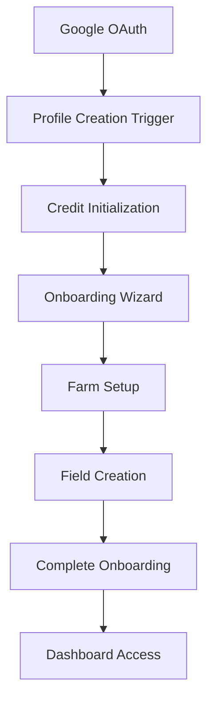

# AUTHENTICATION & ROLE FLOWS - COMPLETE SPECIFICATION

## USER ROLES & PERMISSIONS

### Role Hierarchy
```sql
CREATE TYPE user_role AS ENUM ('admin', 'farmer', 'agronomist', 'viewer');
```

**Role Definitions:**
- `admin`: Full system access, user management, analytics
- `farmer`: Primary user role, farm management, AI features
- `agronomist`: Expert consultation, advanced analytics
- `viewer`: Read-only access, limited features

### Permission Matrix

| Feature | Admin | Farmer | Agronomist | Viewer |
|---------|-------|--------|------------|--------|
| Farm Management | ✅ All | ✅ Own | ✅ Assigned | ❌ |
| Field Operations | ✅ All | ✅ Own | ✅ Assigned | 👁️ View |
| AI Disease Detection | ✅ | ✅ | ✅ | ❌ |
| Weather Intelligence | ✅ | ✅ | ✅ | ✅ |
| Market Intelligence | ✅ | ✅ | ✅ | ✅ |
| Credit Management | ✅ All | ✅ Own | ✅ Own | ❌ |
| WhatsApp Integration | ✅ | ✅ | ✅ | ❌ |
| User Analytics | ✅ | ❌ | 👁️ Limited | ❌ |

## AUTHENTICATION FLOWS

### 1. Google OAuth Flow
```typescript
// Frontend initiation
const { data, error } = await supabase.auth.signInWithOAuth({
  provider: 'google',
  options: {
    redirectTo: `${window.location.origin}/auth/callback`,
    queryParams: {
      access_type: 'offline',
      prompt: 'consent',
    }
  }
});

// Callback handling
const { data: { session }, error } = await supabase.auth.getSession();
if (session) {
  // Trigger: handle_new_user() creates profile
  // Trigger: handle_new_user_credits() initializes 100 credits
}
```

### 2. Email/Password Flow
```typescript
// Sign up
const { data, error } = await supabase.auth.signUp({
  email: 'farmer@example.com',
  password: 'secure_password',
  options: {
    data: {
      full_name: 'John Farmer',
      preferred_language: 'en',
      farm_name: 'Green Valley Farm'
    }
  }
});

// Sign in
const { data, error } = await supabase.auth.signInWithPassword({
  email: 'farmer@example.com',
  password: 'secure_password'
});
```

### 3. Session Management
```typescript
// Auto-refresh configuration
const supabase = createClient(url, key, {
  auth: {
    autoRefreshToken: true,
    persistSession: true,
    detectSessionInUrl: true,
    flowType: 'pkce'
  }
});

// Manual refresh
const { data, error } = await supabase.auth.refreshSession();

// Session monitoring
supabase.auth.onAuthStateChange((event, session) => {
  switch (event) {
    case 'SIGNED_IN':
      // Initialize user context
      break;
    case 'SIGNED_OUT':
      // Clear user data
      break;
    case 'TOKEN_REFRESHED':
      // Update stored tokens
      break;
  }
});
```

## USER JOURNEY FLOWS

### 1. New User Onboarding


**Database Operations:**
```sql
-- Automatic profile creation
INSERT INTO profiles (id, full_name, avatar_url, onboarding_completed)
VALUES (NEW.id, metadata->>'full_name', metadata->>'avatar_url', FALSE);

-- Credit initialization
INSERT INTO user_credits (user_id, balance) VALUES (NEW.id, 100);

-- Onboarding completion
UPDATE profiles SET onboarding_completed = TRUE WHERE id = user_id;
```

### 2. Returning User Flow
```typescript
// Session restoration
const { data: { session } } = await supabase.auth.getSession();

if (session) {
  // Load user profile
  const { data: profile } = await supabase
    .from('profiles')
    .select('*')
    .eq('id', session.user.id)
    .single();
  
  // Check onboarding status
  if (!profile.onboarding_completed) {
    // Redirect to onboarding
  } else {
    // Load dashboard
  }
}
```

### 3. Pro User Upgrade Flow
```typescript
// Credit check for premium features
const { data: credits } = await supabase
  .from('user_credits')
  .select('balance')
  .eq('user_id', user.id)
  .single();

if (credits.balance < requiredCredits) {
  // Show upgrade modal
  // Process payment
  // Add credits via restore_user_credits()
}
```

## ROW LEVEL SECURITY (RLS) POLICIES

### Profile Access
```sql
-- Users can view all profiles (public info only)
CREATE POLICY "Public profiles are viewable by everyone"
ON profiles FOR SELECT USING (true);

-- Users can only update their own profile
CREATE POLICY "Users can update their own profile"
ON profiles FOR UPDATE USING (auth.uid() = id);
```

### Farm & Field Access
```sql
-- Farm ownership
CREATE POLICY "Users can manage their own farms"
ON farms USING (auth.uid() = user_id);

-- Field access through farm ownership
CREATE POLICY "Users can manage fields in their farms"
ON fields USING (
  EXISTS (
    SELECT 1 FROM farms 
    WHERE farms.id = fields.farm_id 
    AND farms.user_id = auth.uid()
  )
);
```

### Task Management
```sql
-- Task visibility: farm owners + assigned users
CREATE POLICY "Tasks are viewable by users who can view the field"
ON tasks FOR SELECT USING (
  EXISTS (
    SELECT 1 FROM fields 
    JOIN farms ON fields.farm_id = farms.id
    WHERE fields.id = tasks.field_id 
    AND (farms.user_id = auth.uid() OR tasks.assigned_to = auth.uid())
  )
);
```

### Credit System Security
```sql
-- Users can only see their own credits
CREATE POLICY "Allow users to read their own credit balance"
ON user_credits FOR SELECT USING (auth.uid() = user_id);

-- Credit transactions are user-specific
CREATE POLICY "Allow users to read their own credit transactions"
ON credit_transactions FOR SELECT USING (auth.uid() = user_id);
```

### AI Insights Protection
```sql
-- Field insights are user-specific
CREATE POLICY "Users can view their own field insights"
ON field_insights FOR SELECT USING (auth.uid() = user_id);

-- User memory is private
CREATE POLICY "Users can read their own memory"
ON user_memory FOR SELECT USING (auth.uid() = user_id);
```

## FEATURE GATING

### Credit-Based Features
```typescript
const FEATURE_COSTS = {
  CROP_SCAN: 5,
  AI_INSIGHTS: 10,
  WEATHER_ALERTS: 2,
  MARKET_ANALYSIS: 8,
  WHATSAPP_NOTIFICATIONS: 1
};

// Feature access check
async function checkFeatureAccess(userId: string, feature: string): Promise<boolean> {
  const cost = FEATURE_COSTS[feature];
  const { data: credits } = await supabase
    .from('user_credits')
    .select('balance')
    .eq('user_id', userId)
    .single();
  
  return credits.balance >= cost;
}

// Deduct credits on usage
async function useFeature(userId: string, feature: string) {
  const cost = FEATURE_COSTS[feature];
  
  const { error } = await supabase.rpc('deduct_user_credits', {
    p_user_id: userId,
    p_amount: cost,
    p_description: `Used ${feature}`
  });
  
  if (error) throw new Error('Insufficient credits');
}
```

### Role-Based Access
```typescript
// Admin-only features
function requireAdmin(userRole: string) {
  if (userRole !== 'admin') {
    throw new Error('Admin access required');
  }
}

// Farmer+ features
function requireFarmerOrAbove(userRole: string) {
  const allowedRoles = ['admin', 'farmer', 'agronomist'];
  if (!allowedRoles.includes(userRole)) {
    throw new Error('Farmer access required');
  }
}
```

## SESSION LIFECYCLE

### Token Management
```typescript
// Enhanced Supabase client with token handling
class EnhancedSupabaseClient {
  private currentAuthToken: string | null = null;
  
  private setupAuthTokenManagement(): void {
    // Handle initial token
    const initialToken = localStorage.getItem('supabase_auth_token');
    if (initialToken) {
      this.currentAuthToken = initialToken;
    }
    
    // Monitor auth state changes
    this.client.auth.onAuthStateChange((event, session) => {
      switch (event) {
        case 'SIGNED_IN':
          if (session?.access_token) {
            localStorage.setItem('supabase_auth_token', session.access_token);
            this.currentAuthToken = session.access_token;
          }
          break;
        case 'SIGNED_OUT':
          localStorage.removeItem('supabase_auth_token');
          this.currentAuthToken = null;
          this.clearOfflineCache();
          break;
        case 'TOKEN_REFRESHED':
          if (session?.access_token) {
            localStorage.setItem('supabase_auth_token', session.access_token);
            this.currentAuthToken = session.access_token;
          }
          break;
      }
    });
  }
}
```

### Offline Authentication
```typescript
// Cache user profile for offline access
const cacheProfile = (profile: UserProfile | null) => {
  try {
    if (profile) {
      localStorage.setItem('auth_profile_cache', JSON.stringify(profile));
    } else {
      localStorage.removeItem('auth_profile_cache');
    }
  } catch (error) {
    console.warn('Failed to cache profile data');
  }
};

// Load cached profile
const loadCachedProfile = (): UserProfile | null => {
  try {
    const cached = localStorage.getItem('auth_profile_cache');
    return cached ? JSON.parse(cached) : null;
  } catch (error) {
    return null;
  }
};
```

## ERROR HANDLING

### Authentication Errors
```typescript
enum AuthErrorCode {
  INVALID_CREDENTIALS = 'auth/invalid-credentials',
  USER_NOT_FOUND = 'auth/user-not-found',
  SESSION_EXPIRED = 'auth/session-expired',
  INSUFFICIENT_PERMISSIONS = 'auth/insufficient-permissions'
}

class AuthError extends Error {
  constructor(
    public code: AuthErrorCode,
    public message: string,
    public userMessage: string
  ) {
    super(message);
  }
}
```

### Session Recovery
```typescript
// Automatic session recovery with retry
async function recoverSession(retryCount = 0): Promise<Session | null> {
  const MAX_RETRIES = 3;
  
  try {
    const { data: { session }, error } = await supabase.auth.getSession();
    
    if (error) {
      if (retryCount < MAX_RETRIES) {
        await new Promise(resolve => setTimeout(resolve, 1000 * Math.pow(2, retryCount)));
        return recoverSession(retryCount + 1);
      }
      throw new AuthError(
        AuthErrorCode.SESSION_EXPIRED,
        error.message,
        'Your session has expired. Please log in again.'
      );
    }
    
    return session;
  } catch (error) {
    if (retryCount < MAX_RETRIES) {
      return recoverSession(retryCount + 1);
    }
    throw error;
  }
}
```

## SECURITY BEST PRACTICES

### Input Validation
```typescript
// Validate user input before database operations
function validateProfileUpdate(updates: Partial<UserProfile>) {
  const schema = z.object({
    full_name: z.string().min(1).max(100).optional(),
    phone_number: z.string().regex(/^\+?[1-9]\d{1,14}$/).optional(),
    farm_name: z.string().min(1).max(200).optional(),
    preferred_language: z.enum(['en', 'sw', 'fr']).optional()
  });
  
  return schema.parse(updates);
}
```

### Rate Limiting
```typescript
// Implement rate limiting for sensitive operations
const rateLimiter = new Map<string, { count: number; resetTime: number }>();

function checkRateLimit(userId: string, operation: string, limit: number, windowMs: number): boolean {
  const key = `${userId}:${operation}`;
  const now = Date.now();
  const record = rateLimiter.get(key);
  
  if (!record || now > record.resetTime) {
    rateLimiter.set(key, { count: 1, resetTime: now + windowMs });
    return true;
  }
  
  if (record.count >= limit) {
    return false;
  }
  
  record.count++;
  return true;
}
```

### Audit Logging
```sql
-- Create audit log for sensitive operations
CREATE TABLE auth_audit_log (
  id UUID PRIMARY KEY DEFAULT gen_random_uuid(),
  user_id UUID REFERENCES auth.users(id),
  operation TEXT NOT NULL,
  details JSONB,
  ip_address INET,
  user_agent TEXT,
  created_at TIMESTAMPTZ DEFAULT now()
);

-- Log authentication events
CREATE OR REPLACE FUNCTION log_auth_event()
RETURNS TRIGGER AS $$
BEGIN
  INSERT INTO auth_audit_log (user_id, operation, details)
  VALUES (NEW.id, TG_OP, row_to_json(NEW));
  RETURN NEW;
END;
$$ LANGUAGE plpgsql;
```